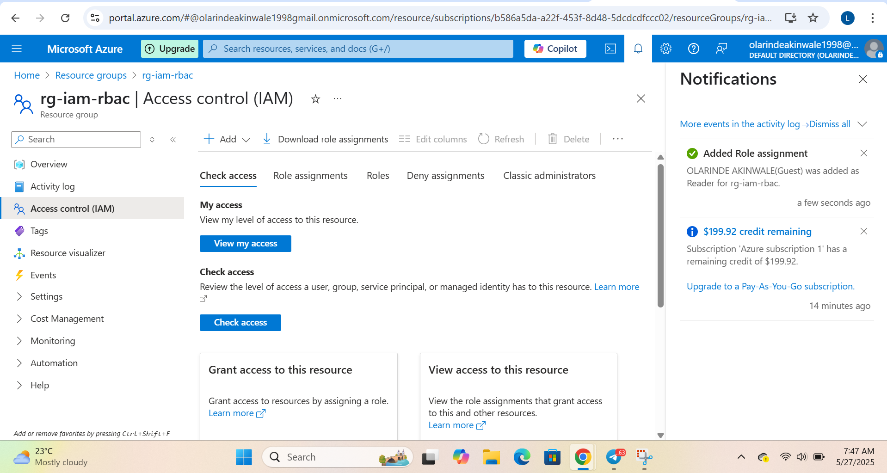
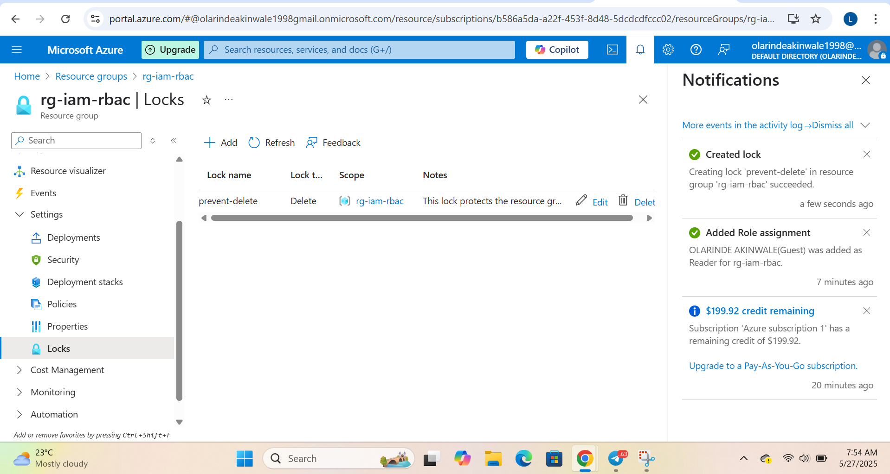
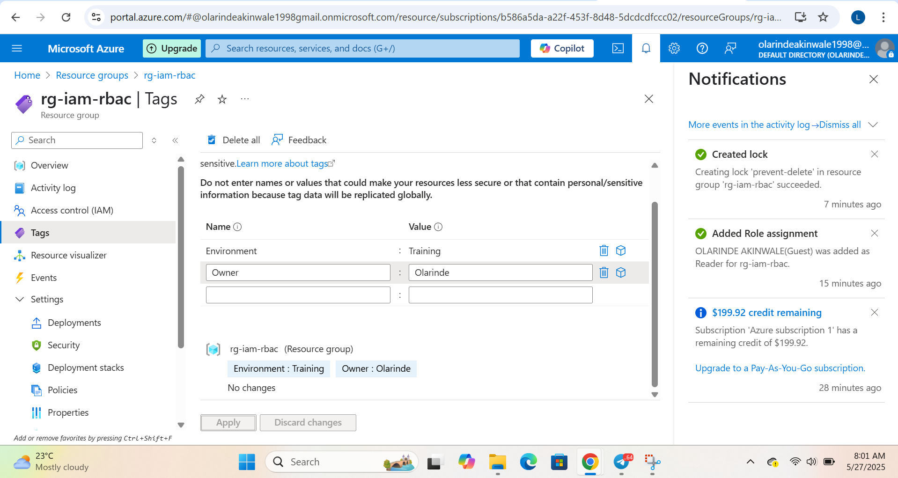
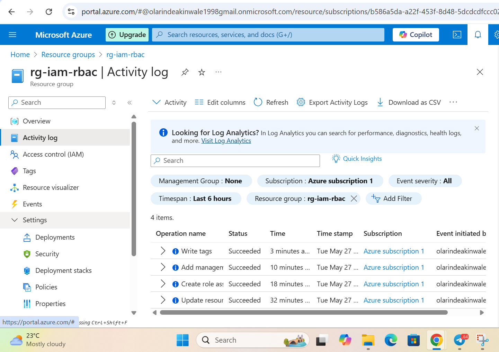
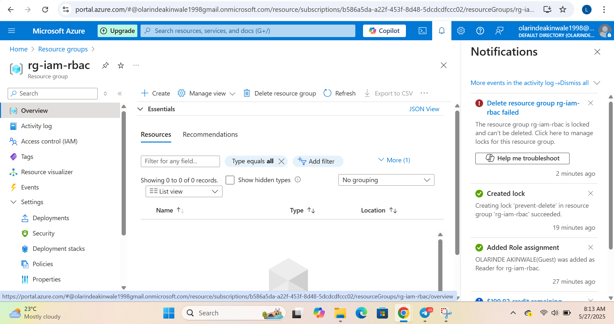
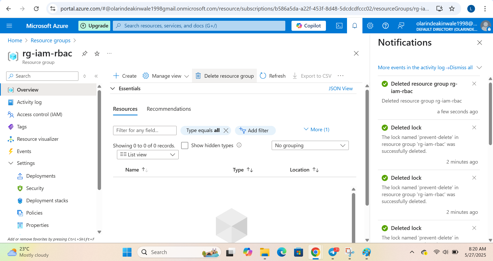

# AZ-104 Project: Managing Resource Access in Azure with RBAC

In this hands-on project, I practiced how to manage access to Azure resources securely using Role-Based Access Control (RBAC), resource locks, and tags. These are some of the key tools cloud admins use to stay in control and avoid mistakes like accidental deletions.

---

## What I Did

- Assigned a Reader role to a user using IAM (Access Control).
- Applied a resource lock to prevent the resource group from being deleted.
- Added tags to help organize and track the resource.
- Verified everything using the Activity Log.
- Tested how resource locks work by trying to delete the resource group (and confirmed it was protected!).
- Then I removed the lock and deleted the resource successfully.

---

## Screenshots

### 1. Role Assignment Confirmed

### 2. Resource Lock Applied

### 3. Tags Added to Resource Group

### 4. Activity Log Shows All Changes

### 5. Delete Attempt Blocked

### 6. Resource Deleted After Unlocking

---

##  What i Learnt

- I learned how to apply least privilege access with RBAC.
- Tagging makes it easier to manage and search resources.
- Resource locks are very useful for protecting critical assets.
- Azure Activity Logs are great for confirming who did what.

---

## Why This Matters

Knowing how to properly assign roles and lock down resources is a must-have skill for any cloud administrator or security engineer. It’s also a big part of the AZ-104 certification.

This project helped me understand those core responsibilities with real examples using the Azure portal.
